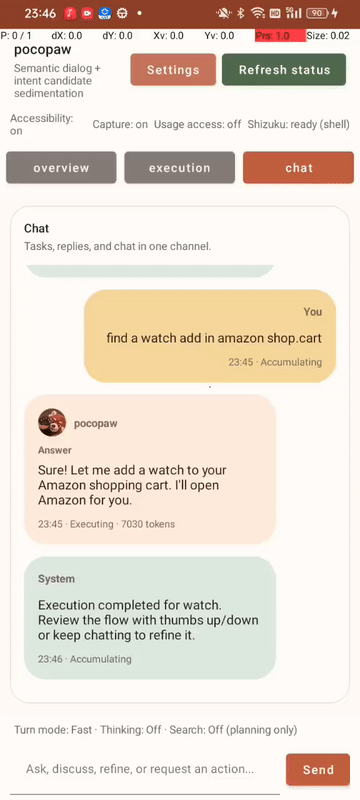
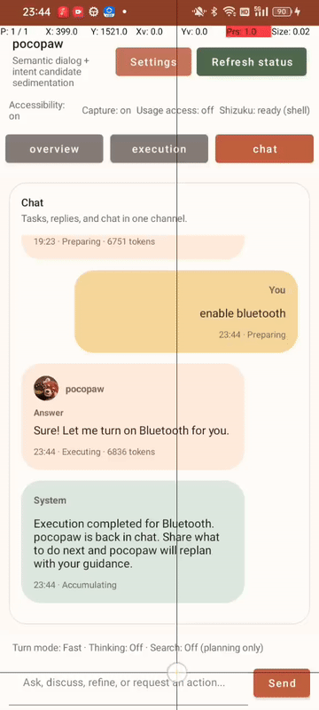
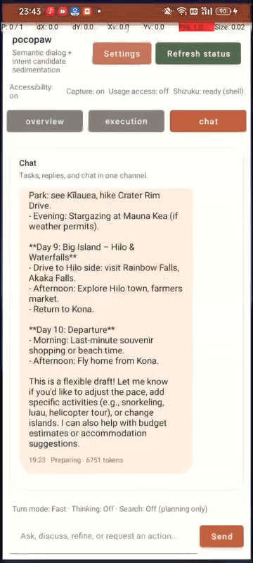

	

# pocopaw

Pocket AI Agent for Android

An open-source Android AI agent that sees the screen, understands context, and controls interfaces like a human.

Inspired by visual-control agent like Midscene and full capability agent like OpenClaw, Pocket AI Agent focuses on practical Android screen understanding and human-like UI control. Its core advantages are clear: fully on-device Android control (instead of PC-driven control, as in many Midscene-style demos) and a lightweight architecture optimized for fast, responsive phone operation (compared with heavier OpenClaw-style setups).

Built for vision-guided mobile automation with reliable tap, swipe, text input, and step-by-step task execution. It can directly invoke Android system intents and operate third-party apps. Around this control loop is a semantic-driven engine that manages human dialogue with prediction, planning, and execution capabilities.

On top of that is a dual-brain model: the semantic brain (big brain) handles end-to-end reasoning and orchestration, while the vision brain (small brain) executes automation actions and continuously syncs execution signals back to the big brain.

Quick links: [Docs](public-docs/README.md) · [Wiki](https://github.com/developer1ab/Pocopaw/wiki) · [Showcases](public-docs/showcases/README.md) · [Install](public-docs/install-and-configure.md) · [Main design](public-docs/main-design.md) · [Roadmap](public-docs/roadmap.md) · [Download v1.0.1 Demo](https://github.com/developer1ab/Pocopaw/releases/tag/v1.0.1) · [License](LICENSE)

## Watch 3 Demo Flows

Start here for the fastest product impression.

<table>
	<tr>
		<td width="33%" valign="top">
			<strong>Overall Flow</strong> 
			End-to-end path from user request to execution writeback.
		</td>
		<td width="33%" valign="top">
			<strong>Shopping Flow</strong> 
			Shopping-oriented request handling with visible execution feedback.
		</td>
		<td width="33%" valign="top">
			<strong>Bluetooth Flow</strong> 
			Bluetooth task execution with completion and conversation writeback.
		</td>
	</tr>
	<tr>
		<td width="33%" valign="bottom">
			
		</td>
		<td width="33%" valign="bottom">
			
		</td>
		<td width="33%" valign="bottom">
			
		</td>
	</tr>
	<tr>
		<td width="33%" valign="top">
			<a href="public-docs/showcases/task-execution-closed-loop.md">Read walkthrough</a>
		</td>
		<td width="33%" valign="top">
			<a href="public-docs/showcases/shopping-flow.md">Read walkthrough</a>
		</td>
		<td width="33%" valign="top">
			<a href="public-docs/showcases/bluetooth-flow.md">Read walkthrough</a>
		</td>
	</tr>
</table>

All showcase pages: [Showcase Hub](public-docs/showcases/README.md)

## What pocopaw is

pocopaw starts from a simple observation: smartphones are now the center of digital life, yet users still have to jump across many isolated apps to finish one complex task.

Most voice assistants can handle only short, single-step commands. They usually cannot coordinate cross-app workflows, deeply understand user habits, or provide proactive help at the right time.

The vision of pocopaw is to build an open-source, all-purpose AI assistant that can:

- Understand natural-language intent across both simple and complex requests.
- Orchestrate apps and services across the phone to complete multi-app tasks automatically.
- Use a pure vision-driven control mode, so it can quickly unlock operational capability on existing apps through view-based interaction.
- Learn user behavior patterns over time and deliver personalized suggestions at the right moment.
- Evolve as an extensible platform where the open-source community can contribute reusable skills and continuously expand capability boundaries.

## Unique Features

- Dual-model architecture for semantic orchestration and execution control.
- Semantic model: understands user intent, performs holistic planning, and dispatches executable tasks.
- Vision model: interprets screenshots and uses accessibility actions plus system intents to decompose each task into concrete steps and directly operate third-party apps.
- Nested semantic-execution collaboration: planning and execution continuously refine each other to deliver end-to-end intent fulfillment.
- Beyond popular skill- or MCP-style agent integrations, pocopaw opens a more hard-core control path through native visual recognition and humanoid click-level interaction, without requiring custom post-integration programming for each app.
- It is a pure Android client app with no dependency on complex PC-side environments or gateway setups: install it on a phone and it appears directly as an AI agent or AI chat box, representing a major control-capability leap from the previous generation of chat-box assistants.

## Product surface

The current product surface has three visible areas:

- A unified conversation surface where the user can ask, refine, discuss, and request actions.
- An execution observation surface where the product shows boundaries, progress, and writeback once a task moves forward.
- A settings and diagnostics surface for model configuration, readiness checks, permission state, and Shizuku preparation.

These are not isolated mini-tools. They are different views over the same local execution chain.

## Architecture at a glance

### 1. One conversation surface

Ordinary chat, reasoning-heavy turns, search-assisted turns, and task requests all stay in one conversation channel. The product is meant to feel like one continuous agent, not a bundle of disconnected modes.

### 2. Meaning first, then stage transition

Not every user message should become an execution task. pocopaw first stabilizes the current semantic state, then decides whether the system should keep accumulating context, enter preparation, or enter execution.

### 3. Execution must cross a clear boundary

Execution does not start from raw natural language. Before execution begins, pocopaw narrows the request into a local execution boundary: objective, missing information, risk boundary, and start conditions.

### 4. Enhancement layers do not replace execution authority

Search, memory, preference, process reuse, and proactivity all matter, but they remain enhancement layers. They can improve the system. They do not get to replace execution authority.

### 5. Local-first controllability

The project prioritizes an Android-local execution path that can be observed, verified, and written back. That is why readiness, permission state, screen capture, accessibility, and process evidence are treated as product-level concerns instead of hidden plumbing.

## Current focus

The project is still centered on Phase 1: Foundation.

Current priorities are:

- Stabilize the path from user input into preparation and execution prerequisites.
- Converge the basic readiness surface around Shizuku, accessibility, and screen capture.
- Keep the interaction style low-friction and low-interruption.
- Establish an explainable search-assisted answer chain.
- Make common requests reliably enter the correct answer, planning, or execution path.

## Roadmap

### Phase 1: Foundation

Make the base chain stable enough for common requests to enter answering, planning, or execution preparation without getting stuck in avoidable friction.

### Phase 2: Experience Upgrade

Make the product faster, smoother, and easier to take over. This phase emphasizes natural interaction, faster control loops, and kiosk-style handoff or takeover surfaces.

### Phase 3: Intelligence Upgrade and Search Refinement

Build stronger prediction, memory, preference, and process reuse capabilities on top of a stable evidence plane, then introduce more timely recommendation and proactive behavior.

### Phase 4: Multi-task Orchestration

Expand the product from a single-task execution agent into one that can decompose, orchestrate, and re-plan more complex task collections.

## Public documentation

- [Public docs index](public-docs/README.md)
- [Install and configure](public-docs/install-and-configure.md)
- [Main design](public-docs/main-design.md)
- [Roadmap](public-docs/roadmap.md)
- [User interaction design](public-docs/user-interaction-design.md)
- [Execution runtime design](public-docs/execution-runtime-design.md)
- [Safety boundary design](public-docs/safety-boundary-design.md)

## License

This repository is licensed under the Business Source License 1.1 (`BUSL-1.1`).

In practical terms:

- individual developers can use the project for learning, research, evaluation, and personal projects under the license terms;
- the Additional Use Grant also permits individual personal production use when the user is not acting for or on behalf of an organization;
- production use by or for an organization, and commercial reuse of the Licensed Work as a product or hosted service, requires a separate commercial license from the Licensor.

See [LICENSE](LICENSE) for the controlling terms.
